# Checkers Game
(Developer Dillon Mc Caffrey)

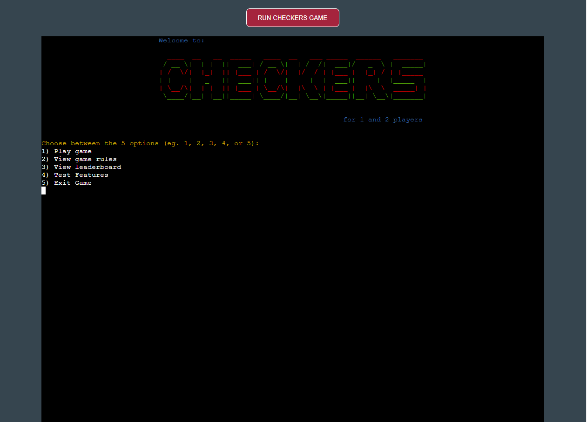

[Live Site](https://ci-pp3-checkers-game.herokuapp.com/) is hosted on Heroku

## About

This is a command-line version of the classic Checkers for one, two or even zero players.

Checkers is a classic board game that is played on an 8x8 board with 64 squares of alternating
colors, red and yellow in this game. The game is played between two players, who each have
12 pieces in their respective colors, either white or black, arranged on opposite sides of the
board.

The objective of the game is to capture all of the opponent's pieces or to block them so they
cannot make any more moves.

The rules of checkers are as follows:

Players take turns moving one piece diagonally forward on the dark squares.

Normal pieces can only move forward, but if they reach the last row on the opposite side of the 
board, they can be promoted to a king, which can move diagonally in any direction.

Captures are made by jumping over an opponent's piece that is adjacent and landing on an
empty square. Multiple jumps are allowed in one turn.

If there is a choice between multiple captures, the player can choose which one to make.

The game ends when one player captures all of the opponent's pieces or blocks them so they cannot
make any more moves.

If a player is unable to make a move or has no legal moves left, they lose the game.

These are the basic rules of checkers, but there are variations in rules depending on the
location and culture where it is played.

## Table of Contents
  - [Project Goals](#project-goals)
    - [User Goals](#user-goals)
    - [Site Owner Goals](#site-owner-goals)
  - [User Experience](#user-experience)
    - [Target Audience](#target-audience)
    - [User Requirements and Expectations](#user-requirements-and-expectations)
    - [User Manual](#user-manual)
  - [User Stories](#user-stories)
    - [Site User](#site-user)
    - [Site Owner](#site-owner)
  - [Technical Design](#technical-design)
    - [Flowchart](#flowchart)
  - [Technologies Used](#technologies-used)
    - [Languages](#languages)
    - [Frameworks & Tools](#frameworks--tools)
    - [Libraries](#libraries)
  - [Features](#features)
  - [Validation](#validation)
  - [Testing](#testing)
    - [Manual Testing](#manual-testing)
    - [Automated Testing](#automated-testing)
  - [Bugs](#bugs)
  - [Deployment](#deployment)
  - [Credits](#credits)
  - [Acknowledgements](#acknowledgements)

## Project Goals

### User Goals
- Play a game of checkers against other players
- Play a game of checkers against the computer
- Have their stats recoreded
- Have a fun time

### Site Owner Goals
- Create a fun checkers game
- Create a game that the user can easily understand how to play
- Allow the user to have a great user experience when playing the game
- Give the user options in all areas of the program

## User Experience

### Target Audience
- People who play board games like chess and checkers
- People who want to play against their friends
- People who want to play against the computer

### User Requirements and Expectations
- Functioning game mechanics and experience
- A way to log in and record a players stats
- Test game features
- View how to play the game
- Get in contact with the developer

### User Manual

Click here to view instructions

#### Main Menu
When the program is run the user is presented with the main menu, the main menu consists of ASCII art presenting "Checkers", and options to choose from
The user is asked to input the option they would like to choose and press enter key
These are the options
1. Play Game
2. View Game rules
3. View Leaderboard
4. Test Features
5. Exit Game

If the user inputs incorrect option the user is asked to try again and is prompted to enter input.
This happens throughout the entire program when user is asked for input
At any point in the logging in process the user can enter "r" to return to the main menu.

#### Play Game
When the Play Game option is selected, the user is asked to enter more input.
The user is asked "How many players?" with 3 options to choose from:
1. One (Player vs CPU)
2. Two (Player vs Players)
3. None (CPU vs CPU)

#### One (Player vs CPU)
When the user selects one, another question is asked.
The user is asked "Has player 1 played before and have an existing accout?" with 2 options to choose from:
1. Yes
2. No

#### Log In Name
When the user chooses Yes, the user is asked "Enter name of player 1".
The user is prompted to enter their name as input.

#### Log In Email
When the user enters their name they are then asked to "Enter email of 'name entered'".
The user is prompted to enter their email as input.

#### Level of difficulty of CPU and Entered Valid Email and Registered
The program checks first if the email is valid by having an @ sign and a domain like .com. 
If it is valid it then checks if the email is registered. If it is registered Logging in is printed
and a new question is asked: "What level of difficulty whould you like the cpu to be?"
Three options are presented: 
1. Beginner
2. Novice
3. Expert
The user is prompted to input one of these options and then the game starts

#### Invalid Email Inputed
If the email entered isn't valid meaning it doesn't have an @ or domain, the user is displayed with an error message and asked to input the email again until it is a valid email

#### Email Not Registered
If the user enters a valid email but that email is not registered yet, the user is displayed with email address not found on database and asked another question. "What would you like to do" and the user is given 2 options:
1. Try entering email again
2. Register as new player
If the user selects option 1 they are brought back to entering a email that is valid and regiserted.
If the user selects option 2 they are displayed with registering alert and then presented with choosing the level of difficulty of CPU and their email is now registered to the system

#### Register Name
When the user selects option 2 "No" for has the player played before or have a registered account. The program asks the user to enter their name similar to log in.
The user is prompted to enter their name.

#### Register Email
After the user hase entered their name they are then prompted to enter their email.
The same as logging in the email is verified to have an @ and a domain and asks the user to reenter email if invalid. The program then checks if the entered email has not been registered

#### Entered Registered Email
If the email entered is already registered an error alert is displayed and then the user is asked to choose from 2 options:
1. Try entering email again
2. Sign in as that player
If the user selects option 1, they are brought back to entering email that is valid and not registered in system.
If the user selects option 2, they are brought to the CPU difficulty selection and they are logged in as the entered email.

#### Two (Player vs Player)
If the user selects option 2 when selecting how many players, the user is brought through the same process as selection option 1 but for 2 players. Player 1 enters if they have played then either logs in or registered but this time instead of selecting CPU difficulty the user logs or registers player 2. And once both players are logged in or registered the game starts

#### None (CPU vs CPU)
If the user selects option 3 when selecting how many players, the user skips over logging or registering any players and goes straight to selecting CPU difficulty. This time the user selects CPU difficulty for 2 CPUs.
First being black and the next being white.

#### Start Game
When one, both or neither players have logged in, selected CPU difficulty and the game starts the board is displayed.
White pieces are at the top and black are at the bottom. Player 1(or CPU 1) is black and player 2 (or CPU 2) is white. Black moves first in checkers.

#### Select Piece
When the game starts and board is displayed.
The user is asked to choose a piece from the movable pieces of their color.
They are presented with however many options depending on the amount of movable pieces.
Options are numbered 1 to however many and ordered from pieces higher up on the board.
If their is a CPU playing this does not happen.

#### Select Move
Once the player has selected a piece the user is then asked to choose a move from the available moves of that piece.
They are presented with however many options depending on the amount of available moves for that piece.
Options are numbered 1 to however many and orded jumps first, then normal moves from left to right then kings moves from left to right.
If their is a CPU playing this does not happen. The CPU selects a move based on a algorithm

#### CPU Select move
Depending on the difficulty of the CPU the CPU selects a move based on a algorithm. If CPU is Beginner the CPU selects a random move from all available moves. If the CPU difficulty is Novice, the CPU selects a move based on a min max algorithm that looks all moves 2 moves in advance. And if the CPU difficulty is Expert, the CPU selects a move based on a min max algorithm that looks at all moves 4 moves in advance

#### Move piece
Once the player has selected a move the piece is then moved to the position selected and any pieces that were jumped are removed. It is then the next persons go. If there are 2 players, player 2 goes through the same process of selecting pieces, and moves but just for the opposite color. The CPU goes through its same process depending on difficulty.

#### Game Over
Once a game has progressed and if one player or CPU, cannot move another piece, either from not having any pieces or their pieces are blocked. The program displays game over and prints out the winner.
Game stats are then shown, where it shows the updated games, wins and loses and total moves of the game.

#### After Game Selection
After the game over has been displayed, the user is then asked what to do next. They have 4 options:
1. Play again
2. Return to main menu
3. View the leaderboards
4. Quit
Option 1 starts a new game with the same players.
Option 2 returns the user to the main menu 
Option 3 brings the user to view the leaderboards and then return to the main menu
Option 4 exits the programme

#### View Game Rules
When the user selects view game rules in the main menu, they are displayed with information on how to play the game and the rules to follow.
They are then prompted to enter option 1 the only option to return back to the main menu

#### View Leaderboard
When the user selects view leaderboard in the main menu, they are displayed with a table showing all the players regiserted in the system ranked in order. The defaul rank order is by wins where most wins is the player ranked number 1.
The user is displayed with 4 options to choose from. These options sort the ranks or returns to main menu.
1. Wins
2. Total Games
3. Loses
4. Return to main menu
Option 1 sorts ranks by most wins
Option 2 sorts ranks by total games played
Option 3 sorts ranks by least loses
Option 4 returns the user to the main menu

#### Test Features
When the user selects test features in the main menu, they are displayed with 6 options to choose from.
These options are:
1. Single Jump
2. Double Jump
3. Triple Jump
4. Quintuple Jump
5. King
6. Jump to King
Any of these options set up a board to test the feature selected.
The program creates a new board and starts a game where the user can test these features

#### Exit Game
When the user selects exit game in the main menu, the program displays a goodbye message and exits the programme.

## User Stories

### Site User

1. I want a nice and easily navigated main menu
2. I want to be able to choose to play against the computer or player, or have 2 computers play against eachother
3. I want to be able to log in to the game
4. I want to be able to register if I have never played before
5. I want to personalise the game by entering my name
6. I want to change the level of difficulty of the computer
7. I want the board to be displayed in a nice and easy to understand way
8. I want to have options like replay the game, or return to the main menu after I have finished the game
9. I want to view the game rules and receive information on how to play
10. I want my stats to be displayed in a leaderboard
11. I want to sort the leaderboard in different ways
12. I want to be able to test certain game features
13. I want to be able to easily exit the programme from the main menu

### Site Owner

14. I want the user to enter valid emails when registering or logging in
15. I want to store the user data so I can use it in the programme
16. I want the user to receive feedback if they enter invalid input
17. I want to thank the user for playing the game

## Technical Design

### Flowchart

The following flowchart summarises the structure and logic of the application.

Flowchart

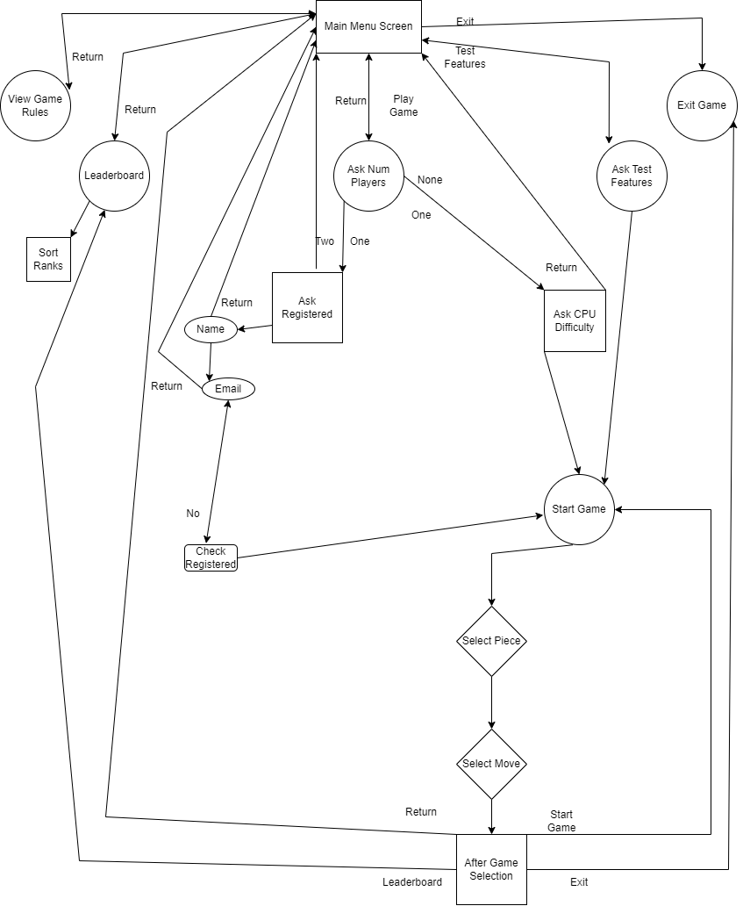

### Languages

- [Python](https://www.python.org/) was used for the programming of logic of the app
- [Node.js](https://www.nodejs.org/) was also used in the deployment of the app

### Frameworks & Tool
- [Font Awesome](https://fontawesome.com/) - icons from Font Awesome were used in the footer below the program terminal
- [Drawio](https://github.com/jgraph/drawio-desktop/releases/tag/v20.8.16) was used to draw a program flowchart
- [GitHub](https://github.com/) was used as a remote repository to store project code
- [Google Cloud Platform](https://cloud.google.com/cloud-console/) was used to manage access and permissions to the Google Services such as Google auth, sheets etc.
- [Google Sheets](https://www.google.co.uk/sheets/about/) were used to store players details
- [PEP8 Code Institute Linter](https://pep8ci.herokuapp.com/) was used to check my code against Python conventions
- [GitPod](https://gitpod.io) was used as workspace to edit code
- [Heroku](https://heroku.com) was used to host the website

### Libraries

#### Python Libraries
- os
- sys
- time
- math
- random
- itemgetter
- io
- [unittest](https://docs.python.org/3/library/unittest.html) - used to carry out testing

#### Third Party Libraries
- [colorama](https://pypi.org/project/colorama/) - I used this library to add color to the terminal and enhance user experience.
- [email_validator](https://pypi.org/project/email-validator/) - I used this library to validate the user email 
- [gspread](https://docs.gspread.org/en/latest/) - I used gspread to add and change data in my Google spreadsheet and to interact with Google APIs
- [google.oauth2.service_account](https://google-auth.readthedocs.io/en/master/) - I used this module to set up the authentication required for accessing the Google API and connecting my Service Account with the Credentials function. I created a creds.json file containing all the necessary details for the API to access my Google account.

## Features

### Main Menu
- Provides the user with a welcome screen where they can easily navigate through the program
- Acts as a hub where the user returns to multiple times when using the program
- User Stories covered: 1

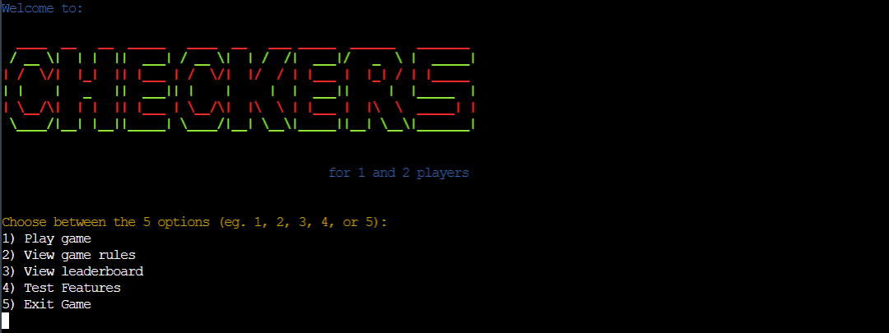

### Choose Number of Players
- Allows the user to choose how many players are going to play
- Add a unique experience to whatever you choose
- Add variety to the game
- User Stories covered: 2

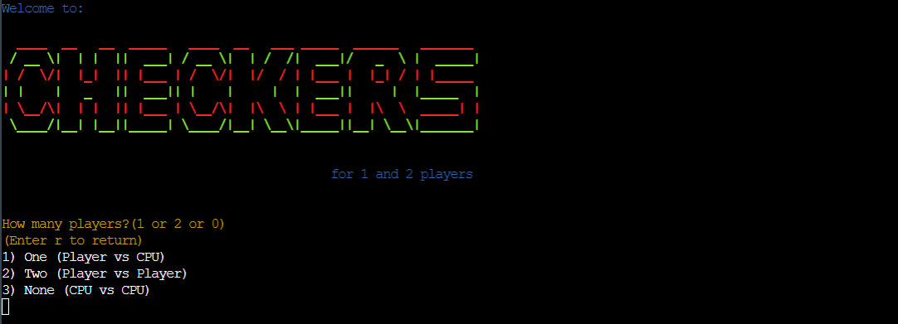

### Log In or Register
- Allows the user to log in or register, so they can record their stats and rank higher on the leaderboard
- Personalises the game as the game can now display your name and stats
- Asks if user is registered, then their name, and email and then logs in or registers them
- User Stories covered: 3, 4, 5, 15

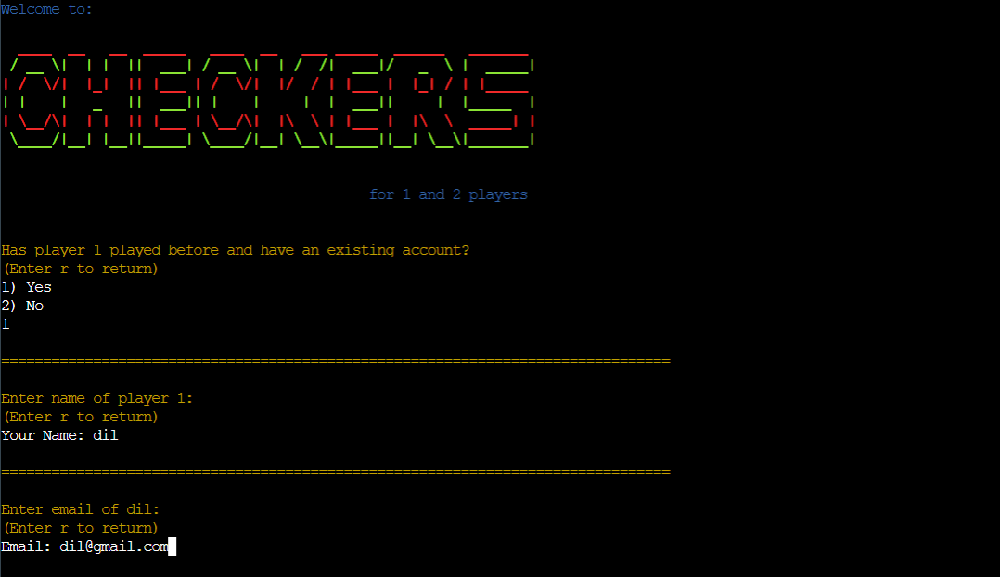

### Validate Email 
- Checks if the email is valid and is registered
- Displays error alert if the user typed in invalid input or the email was not registered
- User Stories covered: 14, 16

### CPU Diffiuclty
- Allows the user to choose what level of difficulty they want the game to be
- This adds variety and changes up the gameplay
- It also makes it interesting to learn from as the computer calculates moves in advance
- User Stories covered: 6

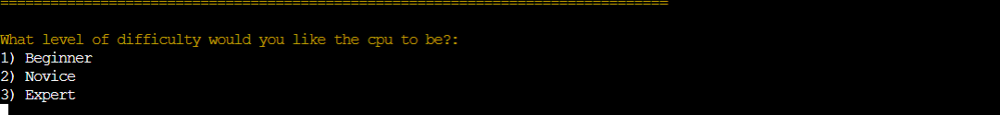

### Start Game
- When the user has logged in successfully, the game starts
- The board is displayed to the user and then the user can select a piece to move
- User Stories Covered: 7

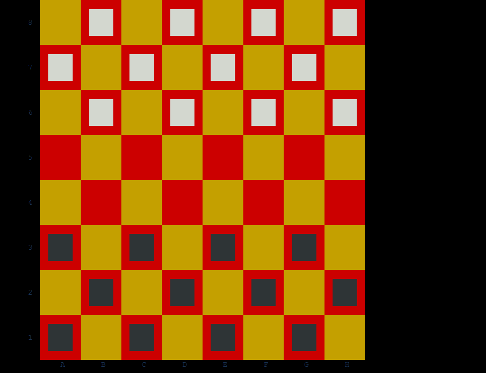

### Select Piece
- Allows the user to select what piece they would like to move from movable pieces
- Displays the options the user has to choose from
- User can input what piece to select

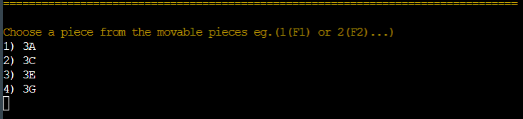

### Select Move
- Allows the user to select what move they would like from available moves
- Displays the options the user has to choose from when they select a piece
- Allows the user to return from selecting a move to select a new piece

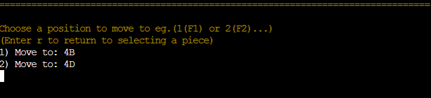

### Game Over
- Displays a game over message when the game is finished
- Congratulates the winner of the game

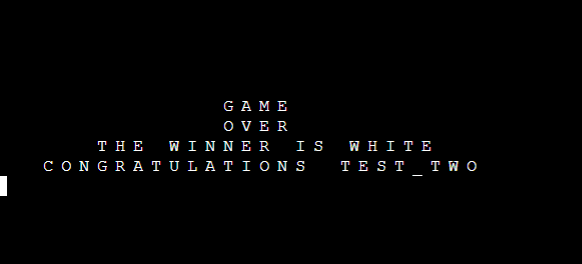

### After Game Selection
- Displays game stats and updates both players stats for leaderboard
- Allows the user to select what to do next, if they want to play again, return to leaderboard or view leaderboard or quit game
- User Stories Covered: 8

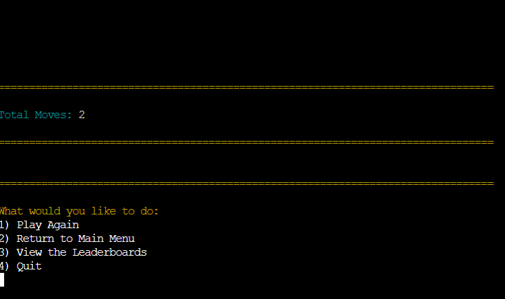

### View Game Rules
- Displays to the user information on how to play the game and what the rules of the game are
- Allows the user to return to main menu again
- User Stories Covered: 9

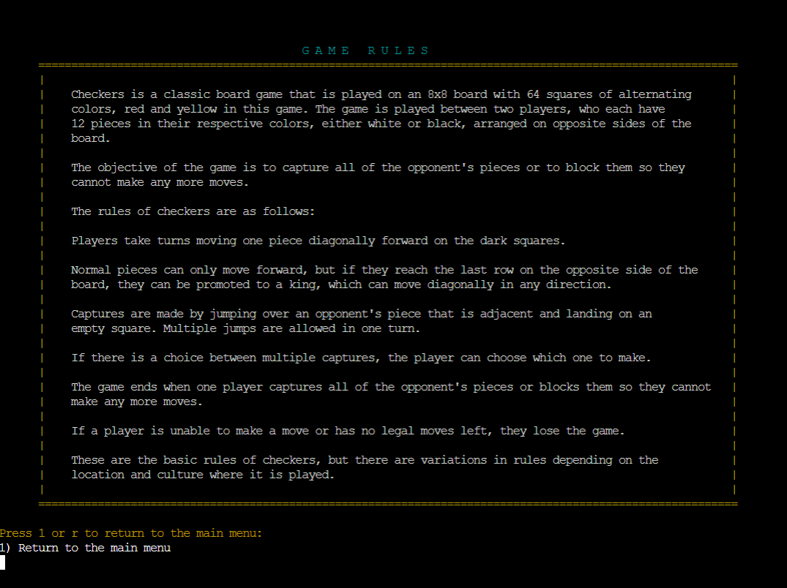

### View Leaderboard
- Displays all users that have registered in a table, ranking them on a particular stat
- Allows the user to check their wins, loses, and total games played
- User Stories covered: 10

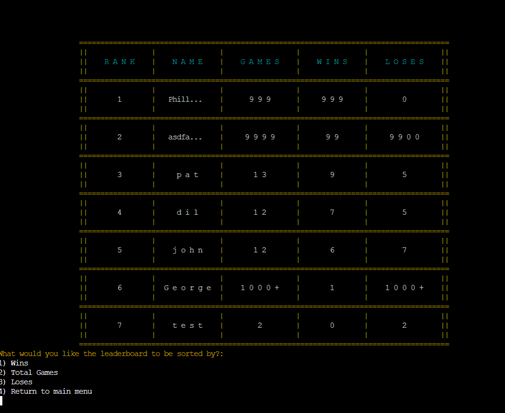

### Sort Leaderboard Ranks
- Allows the user to choose how to sort the ranks of the leaderboard
- They can sort it by wins, loses or total games
- User Stories covered: 11

### Test Features
- Allows the user to set up certain game states in order for user to test a certain functionality or feature of the game
- The user can choose from 6 features to test
- This creates a test game where a test board is set up
- User Stories covered: 12

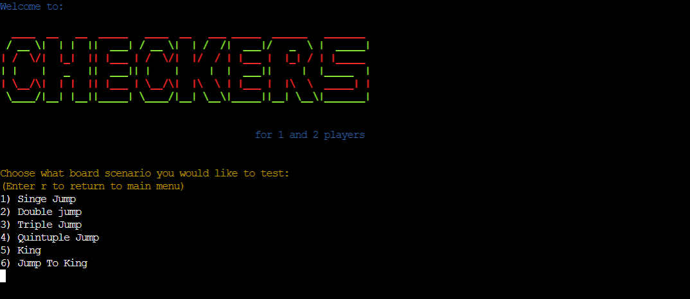

### Exit Game
- Allows the user to exit the application
- Displays a thank you message for the user then it exits the application
- User Stories covered: 13, 17

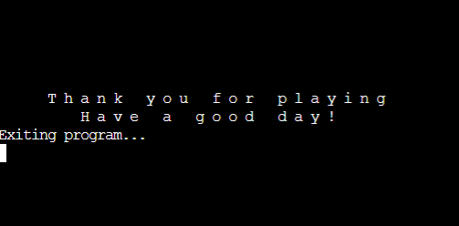

## Validation

## Testing

I first manually tested the user storeis
Then I set up automated unit testing using the python unittest library and checked coverage on it to see what tests I was covering

1. I want a nice and easily navigated main menu

